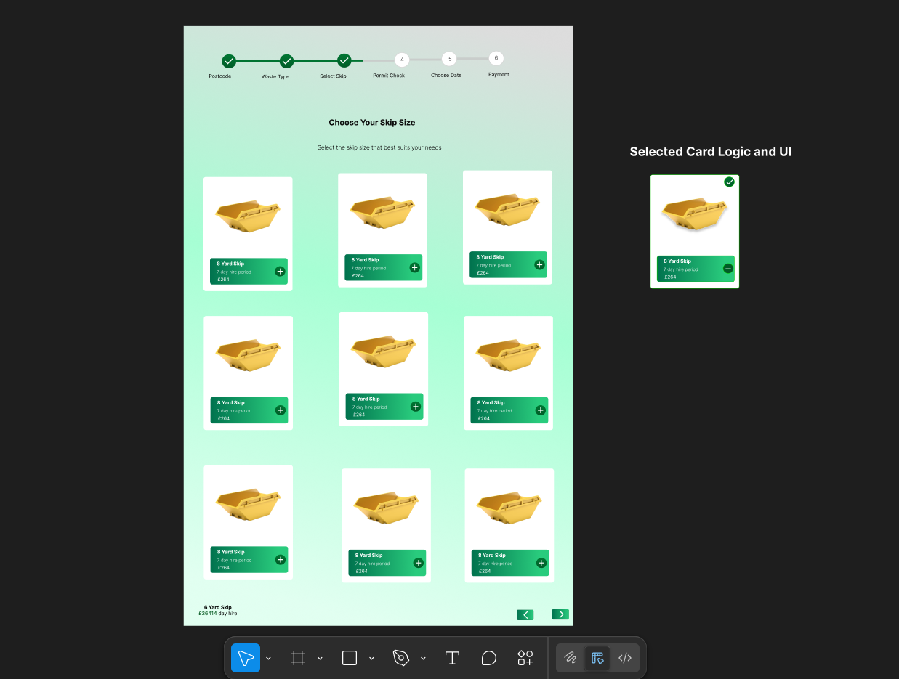

# REMWaste Skip Selection Redesign – React Coding Challenge

This is my submission for the We Want Waste front-end coding challenge.  
I redesigned the "Choose Your Skip Size" page using Figma, then implemented it with a modern, responsive, and animated user interface using **React + Vite**, **TailwindCSS**, and **Framer Motion**.

> Please note: The final coded version may slightly differ from the original Figma design, as I made some necessary adjustments during development.

---

## Objective

Redesign the "Choose Your Skip Size" page from  
[https://wewantwaste.co.uk](https://wewantwaste.co.uk)  
while fetching data from their API and maintaining the core functionality.

---

## Features & Improvements

### UI/UX Enhancements

- Redesigned layout with a clean, modern aesthetic.
- Card-based design for skip options.
- Responsive grid layout for mobile, tablet, and desktop.
- Visual feedback for selected cards with bold outlines.
- Each skip card includes:
  - Skip size title (e.g., `6 Yard Skip`)
  - Price
  - Hire period
  - Select/deselect button with icons

### Visual Improvements

- Hover animation on images using Framer Motion
- Selection highlight with green ring and animated check icon
- Skip images enhance visual recognition
- Smooth entrance, hover, and toggle animations
- Subtle shadows, gradients, and transitions for a polished look

### Functional Features

- Fetches skip data from:
  https://app.wewantwaste.co.uk

- Enables selection and deselection of skip sizes
- Fully functional and reactive component structure

### Code Quality

- Modular and maintainable React codebase
- Dedicated `SkipCard` component for reuse and scalability
- TailwindCSS utility-first classes for fast styling
- Mobile-first responsive design

---

### Figma Design

- You can view the original UI redesign concept on Figma here;
  ==> https://www.figma.com/design/TadFZigcmaGjUvnrDqGUXm/Untitled?node-id=5-2&t=fUp9Vt92Ajze4uIw-1

---

## Deployment

This project is live and publicly accessible here:
🔗 View Live on Vercel
==> https://we-want-wast-ui-redesign.vercel.app

---

## Technologies Used

- [React](https://reactjs.org/)
- [Vite](https://vite.dev/) – Fast frontend build tool
- [TailwindCSS](https://tailwindcss.com/)
- [Framer Motion](https://www.framer.com/motion/) – For animations
- [Lucide React](https://lucide.dev/) – For icon integration

---

## Installation & Setup

1. Clone the repository:
   git clone https://github.com/Nathan821/We-Want-Wast-UI-Redesign.git
   cd We-Want-Wast-UI-Redesign.git

2. Install dependencies:
   npm install

3. Run the development server:
   npm run dev

4. Visit the app at:
   http://localhost:5173

- Notes
  The redesign was approached with flexibility and practicality in mind.

Some UI/UX choices may differ from the initial Figma layout for improved responsiveness or functionality.
